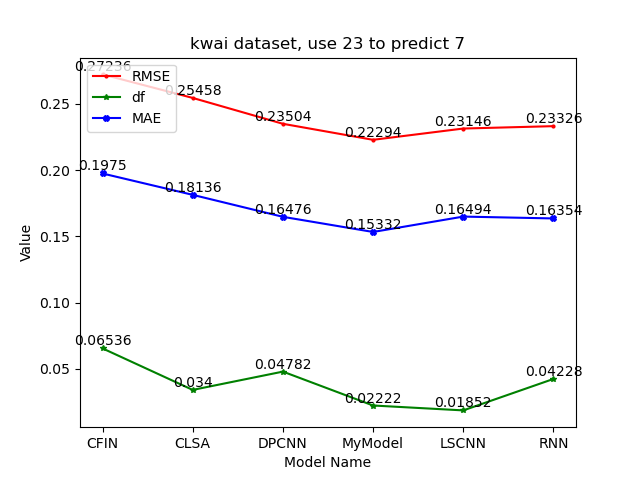
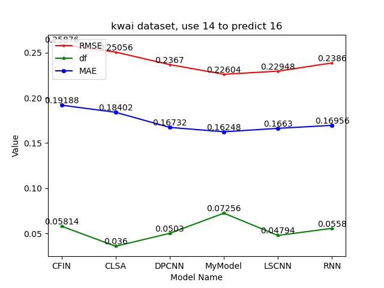
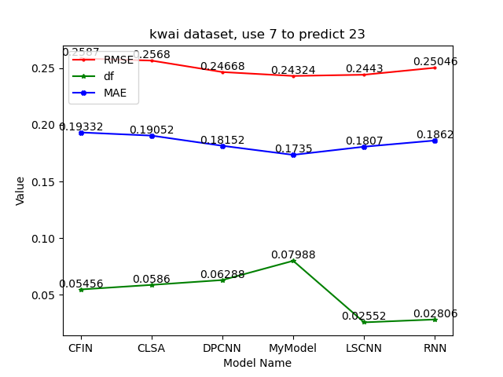
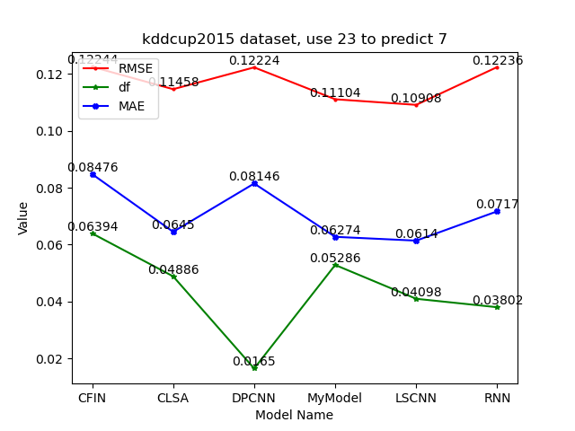
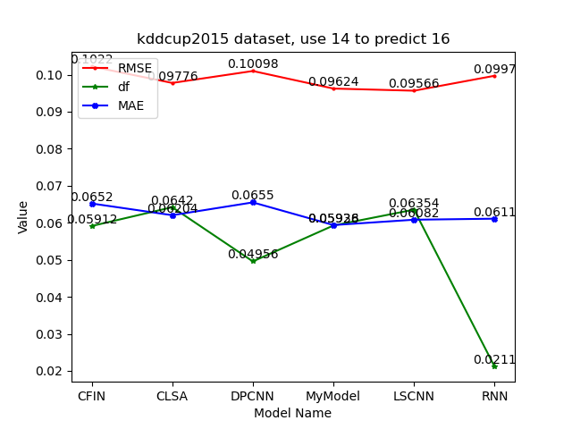

# Website-Daily-Activity-Prediction-Model

> **Kwai (use 23 to predict 7)**

| model name |  CFIN   |  CLSA   |  DPCNN  |  MyModel(single) |  LSCNN  |   RNN   |
|:----------:|:-------:|:-------:|:-------:|:----------------:|:-------:|:-------:|
|    RMSE    | 0.27236 | 0.25458 | 0.23504 |     0.22294      | 0.23146 | 0.23326 |
|     df     | 0.06536 |  0.034  | 0.04782 |     0.02222      | 0.01852 | 0.04228 |
|    MAE     | 0.1975  | 0.18136 | 0.16476 |     0.15332      | 0.16494 | 0.16354 |

> **Kwai (use 14 to predict 16)**

| model_name |   CFIN  |   CLSA  |  DPCNN  | MyModel(single) |  LSCNN  |    RNN  |
|:----------:|:-------:|:-------:|:-------:|:---------------:|:-------:|:-------:|
|    RMSE    | 0.25876 | 0.25056 | 0.2367  |     0.22604     | 0.22948 | 0.2386  |
|     df     | 0.05814 |  0.036  | 0.0503  |     0.07256     | 0.04794 | 0.0558  |
|    MAE     | 0.19188 | 0.18402 | 0.16732 |     0.16248     | 0.1663  | 0.16956 |

> **Kwai (use 7 to predict 23)**

| model_name |  CFIN   |   CLSA  |  DPCNN  | MyModel(single) |  LSCNN  |   RNN   |
|:----------:|:-------:|:-------:|:-------:|:---------------:|:-------:|:-------:|
|    RMSE    | 0.2602  | 0.25756 | 0.24638 |     0.24192     | 0.24368 | 0.25062 |
|     df     | 0.03904 | 0.0522  | 0.0349  |     0.0628      | 0.04348 | 0.0315  |
|    MAE     | 0.19122 | 0.1915  | 0.17862 |     0.17452     | 0.17602 | 0.18592 |

> **kddcup2015 (use 23 to predict 7)**

| model name |  CFIN   |   CLSA  |  DPCNN  | MyModel(single) |  LSCNN  |    RNN  |
|:----------:|:-------:|:-------:|:-------:|:---------------:|:-------:|:-------:|
|    RMSE    | 0.1222  | 0.11494 | 0.12168 |      0.112      | 0.10888 | 0.1231  |
|     df     | 0.06176 | 0.03866 | 0.06536 |     0.0448      | 0.0475  | 0.06648 |
|    MAE     | 0.0843  | 0.06406 | 0.0797  |     0.06346     | 0.06206 | 0.0754  |

> **kddcup2015 (use 14 to predict 16)**

| model name   |  CFIN   |  CLSA   |  DPCNN  | MyModel(single) |  LSCNN  |   RNN  |
|:------------:|:-------:|:-------:|:-------:|:---------------:|:-------:|:------:|
|     RMSE     | 0.1022  | 0.09776 | 0.10098 |     0.09624     | 0.09566 | 0.0997 |
|      df      | 0.05912 | 0.0642  | 0.04956 |     0.05926     | 0.06354 | 0.0211 |
|     MAE      | 0.0652  | 0.06204 | 0.0655  |     0.05938     | 0.06082 | 0.0611 |

